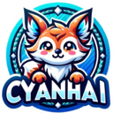

# CyanHai

<!-- PROJECT SHIELDS -->
TODO: 添加项目徽章

<!-- PROJECT LOGO -->

    

<h3>CyanHai</h3>
安全，保密，本地化，可跨平台运行程序的聊天软件。
 
**[更新日志](docs/update.md) ·**
**[计划目录](docs/plan.md) ·**

> My English level is not good. I will use my native language
> for now. If the project becomes bigger later (I am not sure)
> , you are welcome to add English.
>
> 这个项目还处于早期建设状态，本人也是初学者，做这个项目来练练手。
>
> 如果你觉得想法不错，可以点个star，或者给我提提意见，我会非常感谢的。

TODO:添加基本描述

## 平台

TODO: 添加系统要求

## 安装

TODO: 添加安装步骤

## 文件结构

TODO: 添加文件结构